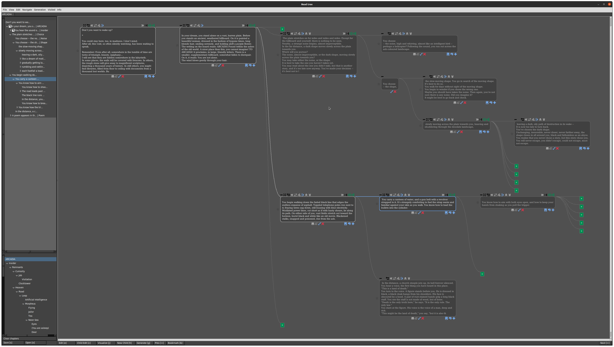
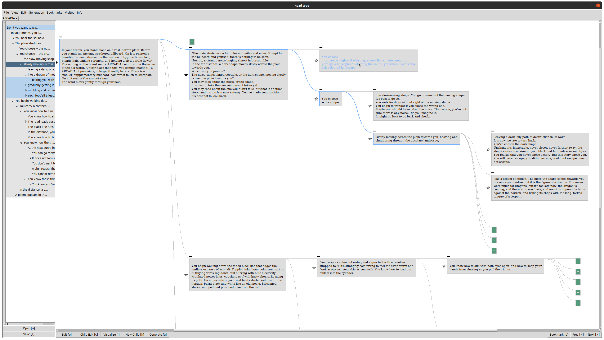

This is an experimental tree-based writing interface for GPT-3. The code is actively being developed and thus 
unstable and poorly documented.

# Features

* Read mode
   * Linear story view
   * Tree nav bar
   * Edit mode
   
   
* Tree view
   * Explore tree visually with mouse
   * Expand and collapse nodes
   * Change tree topology
   * Edit nodes in place
   
   
* Navigation
   * Hotkeys
   * Bookmarks
   * Chapters
   * 'Visited' state   
   

* Generation
   * Generate N children with GPT-3
   * Modify generation settings 
   * Change hidden memory on a node-by-node basis
   

* File I/O
   * Open/save trees as JSON files 
   * Work with trees in multiple tabs
   * Combine trees
   

# Demo






ooo what features! wow so cool

# Hotkeys


### File

Open: `o`, `Control-o`

Import JSON as subtree: `Control-Shift-O`

Save: `s`, `Control-s`


### Dialogs

Change chapter: `Control-y`

Generation Settings: `Control-p`

Visualization Settings: `Control-u`

Multimedia dialog: `u`

Tree Info: `i`, `Control-i`

Node Metadata: `Control+Shift+N`


### Mode / display

Toggle edit / save edits: `e`, `Control-e`

Toggle visualize: `j`, `Control-j`

Child edit: `c`

Toggle input box: `Tab`


### Navigate

Click to go to node: `Control-shift-click`

Next: `period`, `Return`, `Control-period`

Prev: `comma`, `Control-comma`

Go to child: `Right`, `Control-Right`

Go to next sibling: `Down`, `Control-Down`

Go to parent: `Left`, `Control-Left`

Go to previous Sibling: `Up`, `Control-Up`

Return to root: `r`, `Control-r`

Walk: `w`, `Control-w`

Go to checkpoint: `t`

Save checkpoint: `Control-t`

Go to next bookmark: `d`, `Control-d`

Go to prev bookmark: `a`, `Control-a`

Toggle bookmark: `b`, `Control-b`

Search: `Control-f`

Click to split node: `Control-alt-click`


### Generation and memory

Generate: `g`, `Control-g`

Add memory: `Control-m`

View current AI memory: `Control-Shift-m`

View node memory: `Alt-m`


### Edit topology

Delete: `BackSpace`, `Control-BackSpace`

Merge with Parent: `Shift-Left`

Merge with children: `Shift-Right`

Move node up: `Shift-Up`

Move node down: `Shift-Down`

Change parent: `Shift-P`

New Child: `h`, `Control-h`, `Alt-Right`

New Parent: `Alt-Left`

New Sibling: `Alt-Down`


### Edit text

Toggle edit / save edits: `Control-e`

Save edits as new sibling: `Alt-e`

Click to edit history: `Control-click`

Click to select token: `Alt-click`

Next counterfactual token: `Alt-period`

Previous counterfactual token: `Alt-comma`

Apply counterfactual changes: `Alt-return`

Enter text: `Control-bar`

Escape textbox: `Escape`

Prepend newline: `n`, `Control-n`

Prepend space: `Control-Space`


### Collapse / expand

Collapse all except subtree: `Control-colon`

Collapse node: `Control-question`

Collapse subtree: `Control-minus`

Expand children: `Control-quotedbl`

Expand subtree: `Control-plus`


### View

Center view: `l`, `Control-l`

Reset zoom: `Control-0`


# Instructions

1. Install requirements 

    ```pip install -r requirements.txt```
2. Run main.py
3. Load a json tree
4. Read  :)

